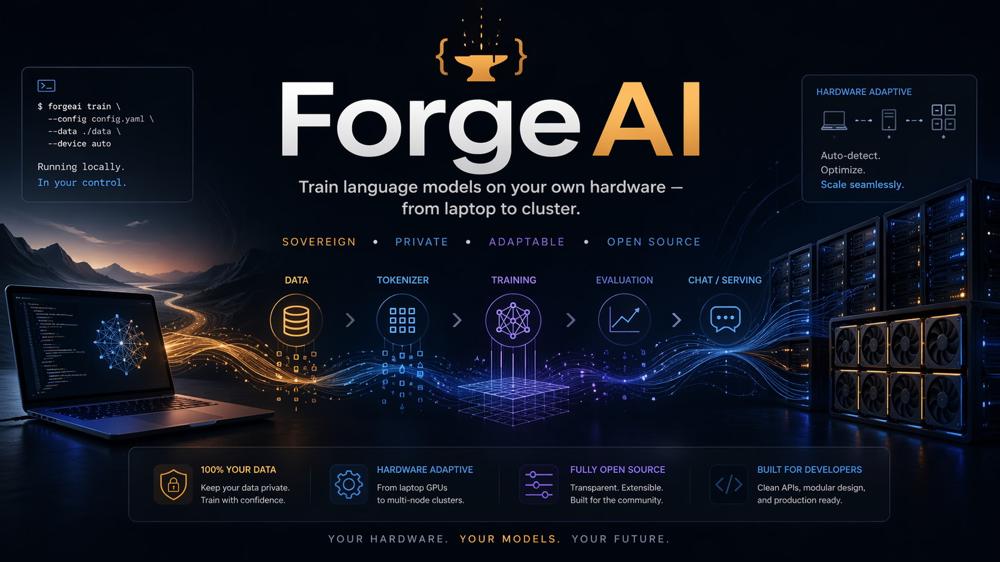

# ForgeAI



**Local-first training workbench for small and mid-sized language models on consumer hardware.**

ForgeAI is an open-source training orchestrator focused on sovereignty: you keep data, training runs, checkpoints, and evaluation local and auditable.

The project is CLI-first and Apple Silicon oriented, with support for CUDA/MPS/CPU paths in the current engine. It is designed to be practical for real local experimentation, not to present itself as a finished frontier-scale training platform.

---

## Documentation Map

- [Current status](./STATUS.md)
- [Roadmap](./ROADMAP.md)
- [Contributing guide](./CONTRIBUTING.md)
- [Architecture (current)](./docs/architecture.md)
- [Stretch v1 details](./docs/stretch.md)
- [Reproducible demo](./docs/reproducible-demo.md)

---

## Current Status (Verified vs Planned)

Short version:

- Implemented now: local CLI pipeline (plan/tokenizer/data/train/eval/chat), PyTorch training on CUDA/MPS/CPU, checkpointing/resume, `forge wizard`, and `forge stretch` v1 with `adapter_plus_manifest` (mapping artifact + deterministic manifest).
- Experimental: local web UI and some lightweight eval/benchmark flows.
- Planned: native MLX training, broader eval depth, more architectures, stronger orchestration.
- Not yet implemented: full multi-node training and stretch `full_checkpoint` output mode.

For details and tested environments, see [STATUS.md](./STATUS.md).

---

## Why ForgeAI Exists

There are good tools for fine-tuning existing models. ForgeAI does something different.

| Tool | Strength | ForgeAI's difference |
|------|----------|---------------------|
| **Axolotl** | Fine-tuning on CUDA | ForgeAI focuses on local-first orchestration across planning + training + eval workflows |
| **Unsloth** | Fast adapter fine-tuning | ForgeAI keeps the from-scratch path and a single local CLI workflow |
| **MLX-LM** | Apple Silicon inference/fine-tuning runtime | ForgeAI complements it with planning, checkpoint lifecycle, and training/eval orchestration |
| **nanoGPT** | Minimal educational trainer | ForgeAI adds CLI UX, checkpoint tooling, planning, and evaluative workflow integration |
| **LLaMA-Factory** | UI-centric fine-tuning | ForgeAI is CLI-first and local-workbench oriented |

**ForgeAI's position**: local-first sovereignty (data → tokenizer → training → evaluation → checkpoint reuse) with hardware-adaptive orchestration for consumer machines and small workstations.

---

## Scope and Honest Expectations

Read this section before anything else.

### What You Can Realistically Train

| Hardware | Conservative range today | Notes |
|----------|--------------------------|-------|
| Apple Silicon laptop (16–24GB unified memory) | ~50M to ~400M | Good fit for local experimentation and end-to-end pipeline validation |
| Apple Silicon desktop (larger unified memory) | ~400M to ~1B | Feasible depending on context length, batch strategy, and runtime constraints |
| Single high-end consumer GPU (e.g. 24GB VRAM) | ~400M to low-B range (experimental) | Configuration-sensitive; treat larger sizes as engineering experiments, not guaranteed defaults |
| Multi-GPU / multi-node | Planned | See roadmap; not yet a verified default path |

### What to Expect from the Models

- Smaller models can be useful when the domain is narrow and data quality is high.
- Strong results still depend on dataset quality, tokenization choices, and training stability.
- This repository does not claim universal "frontier quality" from local runs.

### What ForgeAI Does NOT Do

- Does not ship large pre-trained models. You train your own, or fine-tune existing open models.
- Does not guarantee quality. Training is hard. Data quality, hyperparameters, and compute all matter. ForgeAI gives you the tools and guardrails, not the guarantees.
- Does not make small local models magically equivalent to top hosted frontier systems.
- Does not provide arbitrary external-model adaptation in `forge wizard` v1. The adaptation path currently expects compatible ForgeAI-native checkpoints.

## What ForgeAI Is Not Yet

- Not a complete frontier-scale platform with proven multi-node training in this repository.
- Not a "one click 70B+" product path.
- Not a replacement for rigorous product-specific benchmarks.
- Not a managed cloud service. It is a local toolchain.

---

## Sovereignty Use Cases

This is not about doomsday scenarios. It is about control over your AI stack in normal times.

- **A medical or legal team** keeps sensitive documents on-prem and fine-tunes/evaluates local checkpoints without sending data to third-party APIs.

- **A robotics or home-automation hobbyist** builds a domain assistant specialized for their own logs, device names, and workflows.

- **A research user** runs repeated experiments on tokenizers, context lengths, and training settings with reproducible local artifacts.

- **A hobbyist** with a MacBook Air wants to understand how language models actually work. Trains a 50M model from scratch on TinyStories, inspects every gradient, experiments with learning rate schedules, and reads the source code line by line.

ForgeAI also works fully offline — but that is a side effect of being local, not the main pitch.

---

## How It Works

### Hardware-Adaptive Training

ForgeAI auto-detects your hardware and proposes a conservative training plan. You do not need to hand-tune every low-level setting before a first run.

```bash
$ forge plan --arch transformer --params 400M --data ./my-corpus/
┌──────────────────────────────────────────────────────┐
│  ForgeAI — Training Plan                            │
│                                                      │
│  Hardware   : Apple Silicon (MPS)                    │
│  Backend    : MPS (PyTorch)                          │
│  Model      : Transformer 400M                       │
│  Precision  : bfloat16                               │
│  Batch size : 4 (auto)                               │
│  Optimizer  : AdamW                                  │
│  Tokens     : ~8B (Chinchilla estimate)              │
│                                                      │
│  Estimated time  : ~days to weeks                    │
│  Estimated cost  : shown before training starts      │
│  Checkpoint size : estimated from params             │
└──────────────────────────────────────────────────────┘
```

Key features:
- **Cost and time estimation before training starts** — no surprises at hour 200
- **Auto-configuration** — dtype, batch size, gradient accumulation, optimizer chosen for your hardware
- **Honest constraint reporting** — the planner highlights when a requested setup is likely unrealistic on detected hardware
- **Override everything** — advanced users can set any parameter manually

### Pipeline

```
┌────────────────────────────────────────────────────────────────┐
│                      ForgeAI Pipeline                         │
│                                                                │
│  ┌──────────┐  ┌───────────┐  ┌──────────┐  ┌──────────────┐  │
│  │  Corpus  │─▶│ Tokenizer │─▶│ Training │─▶│  Evaluation  │  │
│  │  (text)  │  │ (BPE/SPM) │  │  Loop    │  │  (online +   │  │
│  └──────────┘  └───────────┘  └────┬─────┘  │   offline)   │  │
│                                    │        └──────┬───────┘  │
│                              ┌─────▼─────┐         │          │
│                              │Checkpoint │◀────────┘          │
│                              └─────┬─────┘                    │
│                                    │                          │
│                              ┌─────▼───────────┐             │
│                              │   Inference     │             │
│                              │  (mlx-lm /      │             │
│                              │   llama.cpp)    │             │
│                              └─────────────────┘             │
└────────────────────────────────────────────────────────────────┘
```

### Forge Stretch (v1)

`forge stretch` persistently extends the context window of an **existing compatible model**.

- Method v1: **YaRN scaling only**
- Persistence v1: **`adapter_plus_manifest` only** (not `full_checkpoint`): source checkpoint copy + YaRN mapping artifact + deterministic manifest
- The target context length must be **strictly greater** than the model's native context
- Validation v1 is **local/proxy**: `forge stretch` includes specific checks for its own workflow, but the repository as a whole does not yet feature a general, reusable long-context benchmark suite (like Needle-in-a-Haystack) in the official `forge eval` module.

Full documentation, examples, and artifact list:
- [`docs/stretch.md`](./docs/stretch.md)

---

## System Design

ForgeAI is a local, single-user tool. No auth service, no API gateway, no microservices. You are the only user.

```
┌──────────────────────────────────────────────────┐
│                  ForgeAI Stack                   │
│                                                  │
│  ┌───────────┐          ┌──────────────────────┐ │
│  │   forge   │          │  Local Web UI        │ │
│  │   (CLI)   │          │  (Next.js :3000)     │ │
│  └─────┬─────┘          └──────────┬───────────┘ │
│        │                           │             │
│        └─────────┬─────────────────┘             │
│                  │                               │
│        ┌─────────▼──────────┐                    │
│        │    forge-engine    │                    │
│        │    (Python core)   │                    │
│        │                    │                    │
│        │  - architectures   │                    │
│        │  - tokenizer       │                    │
│        │  - training loop   │                    │
│        │  - evaluation      │                    │
│        │  - checkpoints     │                    │
│        │  - auto-tuning     │                    │
│        └─────────┬──────────┘                    │
│                  │                               │
│     ┌────────────┼────────────┐                  │
│     │            │            │                  │
│   ┌─▼──┐   ┌────▼──────┐  ┌──▼────┐             │
│   │MLX │   │   CUDA    │  │ CPU   │             │
│   └────┘   └───────────┘  └───────┘             │
└──────────────────────────────────────────────────┘
```

| Component | Role |
|-----------|------|
| **forge (CLI)** | `forge plan`, `forge train`, `forge eval`, `forge eval-compare`, `forge chat`, `forge wizard`, `forge stretch` |
| **forge-engine** | Python core: architectures, tokenizer, training loop, evaluation, checkpoints, hardware auto-tuning |
| **web (local UI)** | Optional Next.js dashboard (experimental MVP): basic monitoring + helper pages for eval/chat/hardware |
| **Inference** | Delegated to `mlx-lm` (Apple Silicon) and `llama.cpp` (cross-platform) for v0.1 |

---

## Architecture

### v0.1: Transformer (decoder-only)

One architecture, done properly. Modern GPT-style defaults following LLaMA/Mistral design:

```
Decoder-only Transformer
  ├── Token embedding (no learned positional — RoPE instead)
  ├── N × TransformerBlock
  │     ├── RMSNorm (pre-norm)
  │     ├── Grouped Query Attention (GQA) + RoPE
  │     ├── RMSNorm
  │     └── SwiGLU FFN
  └── RMSNorm → LM head (weight-tied to embedding)
```

The implementation in `apps/forge-engine/app/architectures/transformer.py` is compact and heavily commented. The codebase is structured to be pluggable — adding an architecture means implementing a `BaseModel` interface and registering it.

### Architecture Comparison

| Architecture | Status | Best For | Trade-off |
|---|---|---|---|
| **Transformer** | ✅ v0.1 | General purpose, most tooling/research support | Quadratic attention cost with sequence length |
| **Mamba (SSM)** | 🚧 Planned v1.0+ | Long documents, lower memory | Newer, less tooling, MLX support still maturing |
| **RWKV** | 🚧 Planned v1.0+ | Fast inference, CPU-friendly | Less proven at scale |
| **MoE** | 🚧 Community-driven | Efficient scaling, multi-domain | Complex routing, harder to train |

Only one additional architecture will be added in v1.0, chosen based on community demand. The others ship when someone builds them and the PR passes review.

---

## Backend

ForgeAI is Apple Silicon focused and MLX-oriented, but the current training implementation is PyTorch-based.

| Backend | Current training status | Inference integration | Notes |
|---------|-------------------------|-----------------------|-------|
| **CUDA (PyTorch)** | ✅ Implemented | `llama.cpp` | Best-supported training path today |
| **MPS (PyTorch on Apple Silicon)** | ✅ Implemented | `llama.cpp` | Works locally on Mac; performance depends on memory pressure |
| **MLX** | 🚧 Planned/in progress for native training | `mlx-lm` | MLX package detection exists; native MLX training loop is not yet complete |
| **CPU (PyTorch)** | ✅ Implemented (slow) | `llama.cpp` | Useful for smoke tests and debugging |

Auto-detection runs at startup and selects backend plus dtype recommendation. The recommendation is heuristic and should be treated as a starting point.

### Hardware Examples

| Hardware | Backend | Practical range (today) | Notes |
|----------|---------|-------------------------|-------|
| MacBook Air/Pro (Apple Silicon) | MPS (training) + MLX tooling | 50M–400M commonly practical | Good for local experiments and fast iteration |
| Mac Studio class (higher unified memory) | MPS (training) + MLX tooling | 400M–1B commonly practical | Larger runs are possible but configuration-sensitive |
| RTX 4090 24GB class | CUDA | 400M to low-B range (experimental) | Depends strongly on context length and batch strategy |
| Multi-GPU servers | Planned | Planned | See roadmap; not yet a verified default path |

---

## Starter Models

ForgeAI is a training tool, not a model distributor. The primary workflow is: bring your data, train your model.

For testing the pipeline, ForgeAI can import existing open-source models into ForgeAI checkpoint format:

| Model | Source | Params | License | Notes |
|-------|--------|--------|---------|-------|
| `smollm-135m` | HuggingFace SmolLM | 135M | Apache 2.0 | Good for testing the pipeline |
| `qwen2.5-0.5b` | Alibaba Qwen team | 494M | Apache 2.0 | Strong multilingual |
| `tinyllama-1b` | TinyLlama project | 1.1B | Apache 2.0 | Needs ≥16GB RAM |

These are not ForgeAI models. Full credit goes to the upstream authors. ForgeAI provides a converter and a consistent interface for fine-tuning.

ForgeAI may also include 1–2 tiny demo models (50M–150M) trained on TinyStories for instant pipeline testing. These are labeled as toy demos — do not expect useful output from them.

---

## Evaluation and Benchmarking

Training without evaluation is flying blind. ForgeAI treats evaluation as a first-class part of every training run.

### During Training (online)

- **Validation perplexity** — logged every N steps on a held-out split
- **Loss and learning rate curves** — real-time in the local web UI
- **Gradient norm** — tracked to catch instabilities before they waste hours of compute

### Offline Benchmarks

- **TinyStories proxy check** — qualitative generation/repetition heuristic on fixed prompts
- **HellaSwag-mini local check** — optional 0-shot accuracy only when you provide a local JSONL file (`--hellaswag-data`)
- **Perplexity** remains the primary local quantitative metric in v0.1

These checks are useful for comparing your runs, catching regressions, and spotting obvious failure modes. They are not a substitute for application-specific benchmark suites.

### Cost Tracking

- **GPU-hours consumed** per run
- **Estimated electricity cost** (configure your €/kWh rate)
- **Checkpoint size** on disk, total storage consumed

### Comparison Mode

Train two models with different configs and compare metrics side by side:
```bash
forge eval-compare ./checkpoints/run-a/latest ./checkpoints/run-b/latest
```

Exports comparison as markdown, viewable in the experimental web UI or as a file.

---

## Quick Start

### Requirements

- Python 3.11+
- `pip install -e ./apps/forge-engine`
- Optional extras:
  - Apple Silicon inference tooling: `pip install mlx mlx-lm`
  - CUDA fine-tuning helpers/runtime extras as needed for your environment
- Node.js 20+ (optional, for the local web UI)

### Install

```bash
git clone https://github.com/usernotfinded/ForgeAI.git
cd ForgeAI
pip install -e ./apps/forge-engine
```

### Chat with a pre-existing model

```bash
# Download a compatible open model snapshot (Hugging Face files)
forge model pull smollm-135m --skip-convert

# Apple Silicon path (mlx-lm): chat directly from HF folder
forge chat ./models/smollm-135m-hf --engine mlx
```

If you want to use the converted ForgeAI checkpoint path, run `forge model pull smollm-135m` (without `--skip-convert`) and provide a compatible tokenizer when using the PyTorch chat engine.

### Train from scratch

```bash
# 1. See what your hardware can handle
forge plan --arch transformer --params 400M --data ./my-corpus/

# 2. Train a tokenizer on raw text
forge tokenizer train --data ./my-corpus/ --vocab-size 8000 --output ./tokenizers/my-tokenizer/

# 3. Prepare tokenized shards
forge data prepare ./my-corpus/ --output ./data/processed/ --tokenizer ./tokenizers/my-tokenizer/

# 4. Train
forge train \
  --arch transformer \
  --params 400M \
  --data ./data/processed/ \
  --tokenizer ./tokenizers/my-tokenizer/ \
  --output ./checkpoints/my-run/

# 5. Evaluate
forge eval ./checkpoints/my-run/latest --benchmark perplexity --data ./data/processed/ --tokenizer ./tokenizers/my-tokenizer/

# Optional local checks:
# forge eval ./checkpoints/my-run/latest --benchmark tinystories --tokenizer ./tokenizers/my-tokenizer/
# forge eval ./checkpoints/my-run/latest --benchmark hellaswag-mini --hellaswag-data ./benchmarks/hellaswag_val.jsonl --tokenizer ./tokenizers/my-tokenizer/

# 6. Chat
forge chat ./checkpoints/my-run/latest --tokenizer ./tokenizers/my-tokenizer/ --engine pytorch
```

### Local Web UI (MVP)

```bash
cd apps/web && npm install && npm run dev
# Open http://localhost:3000
# Status: experimental/prototype local dashboard (not production-ready)
# Note: install/test depends on local npm install; no lockfile is committed in this repository yet.
```

### Minimal Smoke Test

If you just cloned the repository, run the smoke demo to verify end-to-end pipeline wiring on toy data (not model quality). The script exercises tokenizer training, data prepare, planning, short training, eval, checkpoint load, and tiny sample generation.

```bash
./scripts/smoke_test.sh
```

Reproducible demo details (artifacts, expected outputs, limits):
- [`docs/reproducible-demo.md`](./docs/reproducible-demo.md)

### Development Checks

The repository includes a lightweight CPU-only quality gate used in CI.
Contributor workflow details are in [`CONTRIBUTING.md`](./CONTRIBUTING.md).

```bash
# 1) Install forge-engine in editable mode + lightweight test deps
python -m pip install -e ./apps/forge-engine --no-deps
python -m pip install pytest ruff typer rich numpy tqdm pydantic fastapi uvicorn tokenizers safetensors

# 2) Run the same checks used by CI
./scripts/dev_checks.sh
```

### v0.1 Release Checklist

```bash
# editable install
python -m pip install -e ./apps/forge-engine --no-deps

# required checks
./scripts/check_no_duplicate_suffix.sh
ruff check .
pytest apps/forge-engine/tests -q -p no:cacheprovider
mypy --strict apps/forge-engine/app
./scripts/dev_checks.sh

# optional local smoke
./scripts/smoke_test.sh
```

---

## Project Structure

- `apps/forge-engine/`: Python core + CLI (`forge`) for planning, training, evaluation, wizard, and stretch flows.
- `apps/web/`: optional local web UI (MVP).
- `docs/`: feature docs and architecture decision records.
- `scripts/`: reproducible smoke test and developer checks.
- `papers/`: curated reading list for architectures/training/eval topics.

Detailed architecture and module map:
- [`docs/architecture.md`](./docs/architecture.md)

---

## Research Papers

The `papers/` directory is a learning resource organized by topic and lab. See [papers/README.md](papers/README.md) for the annotated reading list (~35 papers covering architectures, training, alignment, tokenization, and inference).

PDFs are gitignored — they are already compressed, zipping them saves only 5–15% and adds friction. The reading list in `papers/README.md` has direct arXiv links for every paper. Download what you need. If you want PDFs in the repo, use [git-lfs](https://git-lfs.com).

---

## Roadmap

ForgeAI uses a staged roadmap focused on shipping verifiable increments:

- Phase 0: reliability and smoke tests
- Phase 1: local training workflow hardening
- Phase 2: Apple Silicon / MLX-native improvements
- Phase 3: evaluation and model-quality depth
- Phase 4: UI and advanced orchestration

Full details:
- [`ROADMAP.md`](./ROADMAP.md)

---

## Out of Scope

These are explicitly not planned for v0.1 – v1.0. They may happen later or as community contributions.

| Feature | Reason |
|---------|--------|
| Custom inference server (KV cache, streaming, quantization) | `mlx-lm` and `llama.cpp` do this well. Not worth reinventing. |
| Kubernetes / Terraform deployment | ForgeAI is a local tool. Cloud orchestration is a different product. |
| Auth, 2FA, CSRF, rate limiting, GDPR | Single-user local tool. No multi-tenancy, no server exposure. |
| RLHF / DPO alignment | Requires reward models, preference data, and significant compute. Out of reach for v0.x. |
| MoE architecture | Complex routing, harder to train correctly. Community-contributed if demand exists. |
| TensorRT / ONNX export | Worth exploring later. Not for v0.x – v1.0. |
| Pre-trained models above 400M | Requires compute budget not currently available. Users train their own. |
| Competing with Claude/GPT-4 on general capability | Not the goal. ForgeAI optimizes for sovereignty and specialization, not frontier performance. If someone opens an issue asking "why isn't this as good as ChatGPT," the answer is in this table. |

---

## Community-Driven Exploration

Not committed deliverables. These happen if contributors build them.

- Additional architectures beyond Transformer + one other
- Advanced alignment (PPO, GRPO, constitutional AI)
- Model merging and ensembling
- Distributed training across heterogeneous hardware (mixed MLX + CUDA)
- Dataset curation and deduplication tools
- Quantization-aware training

---

## Security

ForgeAI is a local tool. There is no auth layer. Do not expose the web UI to the public internet. It binds to `localhost:3000` by default.

If you want to expose the inference endpoint on your LAN, use a basic API key via environment variable. This is optional and not the default.

---

## Papers

See [papers/README.md](papers/README.md) for an annotated reading list organized by topic (architectures, training, alignment, tokenization, inference) and by lab (DeepSeek, Moonshot/Kimi, Google, Meta, Mistral).

PDFs are gitignored. Download what you need via the arXiv links in the reading list.

---

## FAQ

**Q: Why would I train from scratch instead of fine-tuning Llama?**

Fine-tuning is faster and usually sufficient. Train from scratch when: (1) you need a custom tokenizer for a low-resource language or specialized domain vocabulary, (2) you want complete control over the architecture and training dynamics, (3) you are learning how LLMs work from the ground up, or (4) licensing compliance requires no derivative weights from a specific base model.

**Q: Can I really train a useful model on a MacBook?**

Yes, at the 50M–400M scale. "Useful" depends on your use case. A 400M model will not write code like Claude, but it can learn your writing style, summarize domain-specific documents, classify support tickets, or control simple automation tasks. Many practical applications do not need a frontier model.

**Q: Is this legal? Can I train on copyrighted data?**

ForgeAI is a tool. What you train on is your responsibility. Many jurisdictions have fair use or text-and-data-mining (TDM) exemptions for research (EU AI Act Article 4, US fair use doctrine). Consult a lawyer if you plan to train on non-permissive data for commercial use. ForgeAI does not include any datasets — you bring your own.

**Q: How is this different from just running nanoGPT?**

nanoGPT is a minimal educational implementation (~300 lines). ForgeAI builds on the same pedagogical spirit but adds: hardware auto-detection and configuration, cost/time estimation before training, lightweight local evaluation checks, checkpoint management, an experimental local web UI for monitoring, and a roadmap toward broader orchestration. Think of it as nanoGPT grown up into a usable tool.

---

## License

MIT — see [LICENSE](LICENSE) for details.
